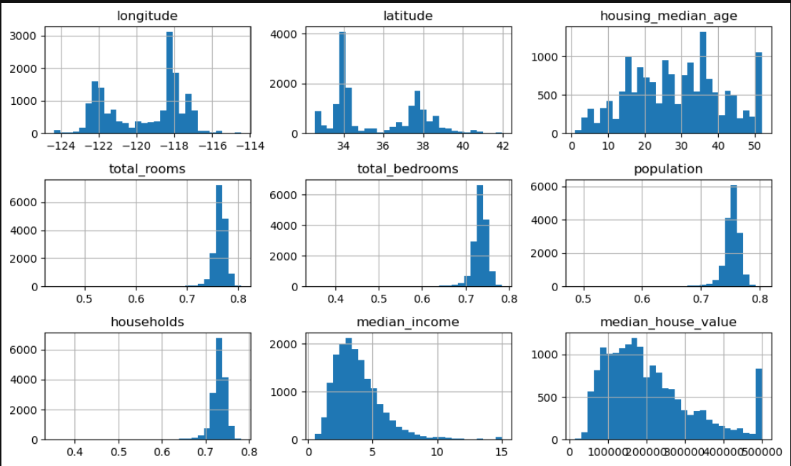
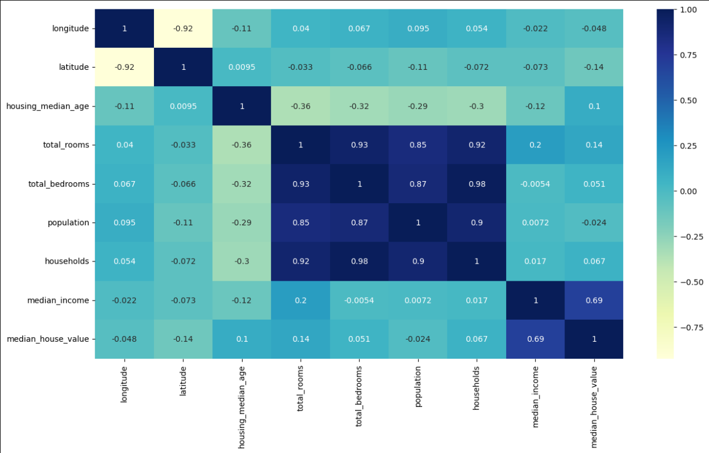
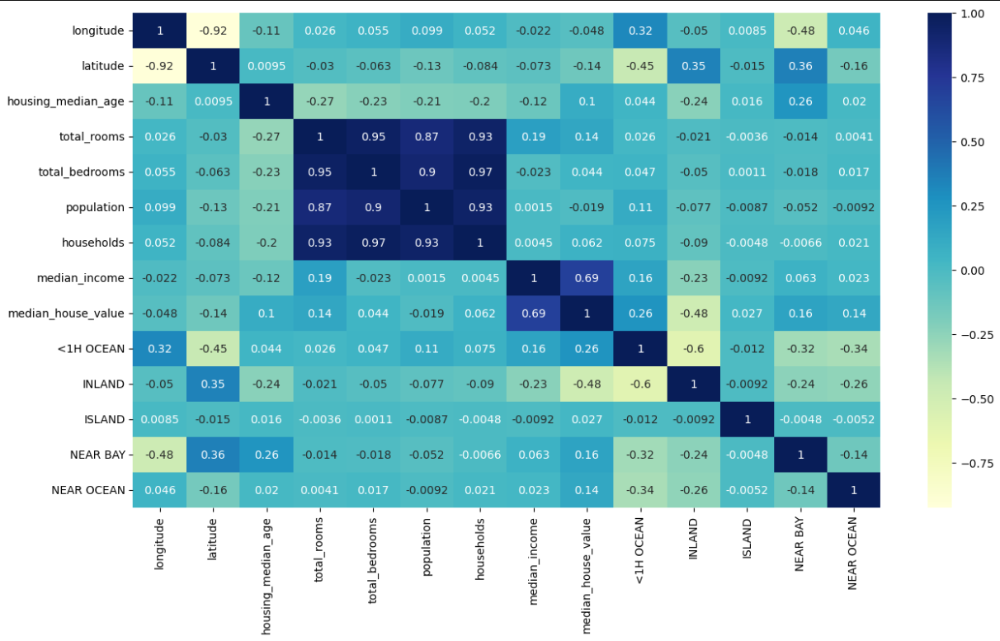
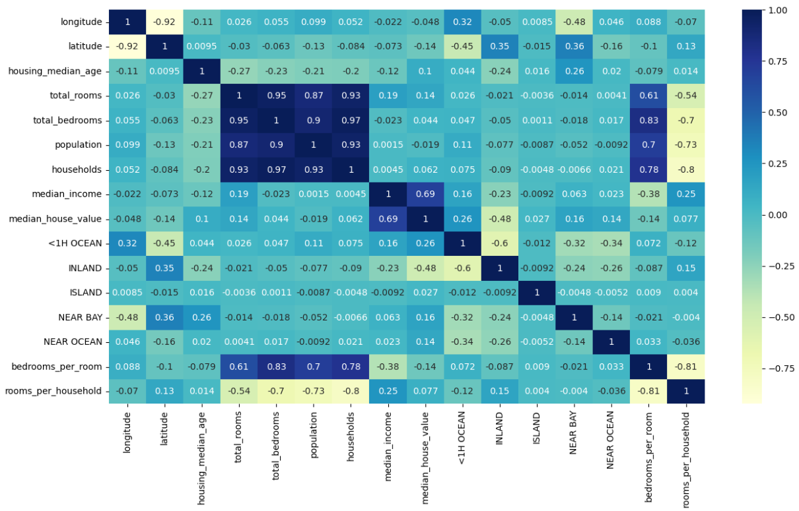
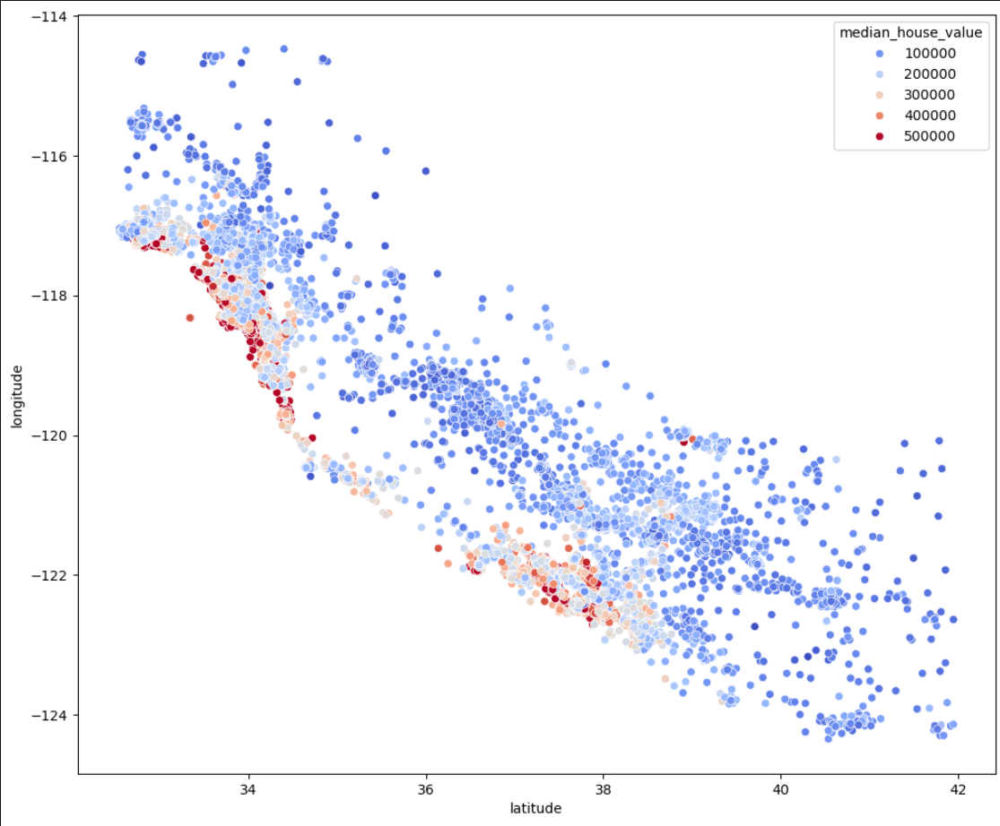
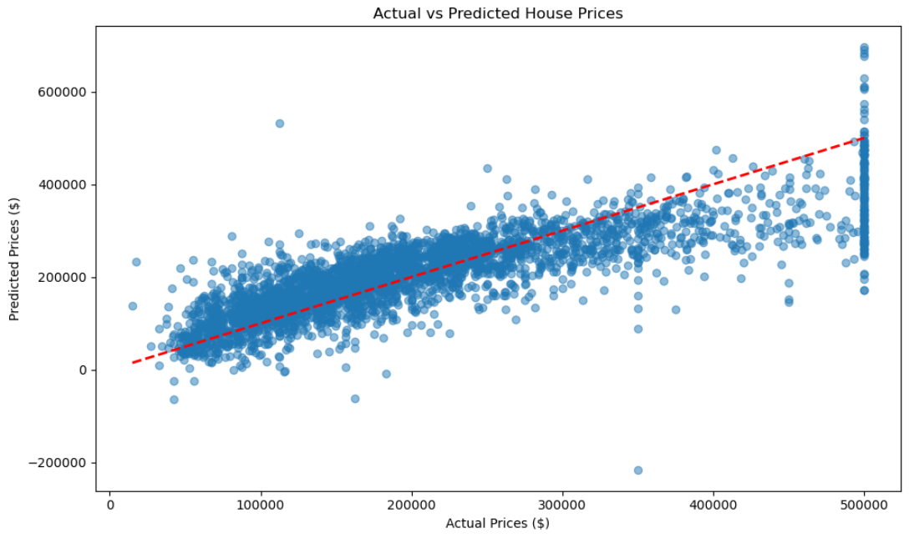
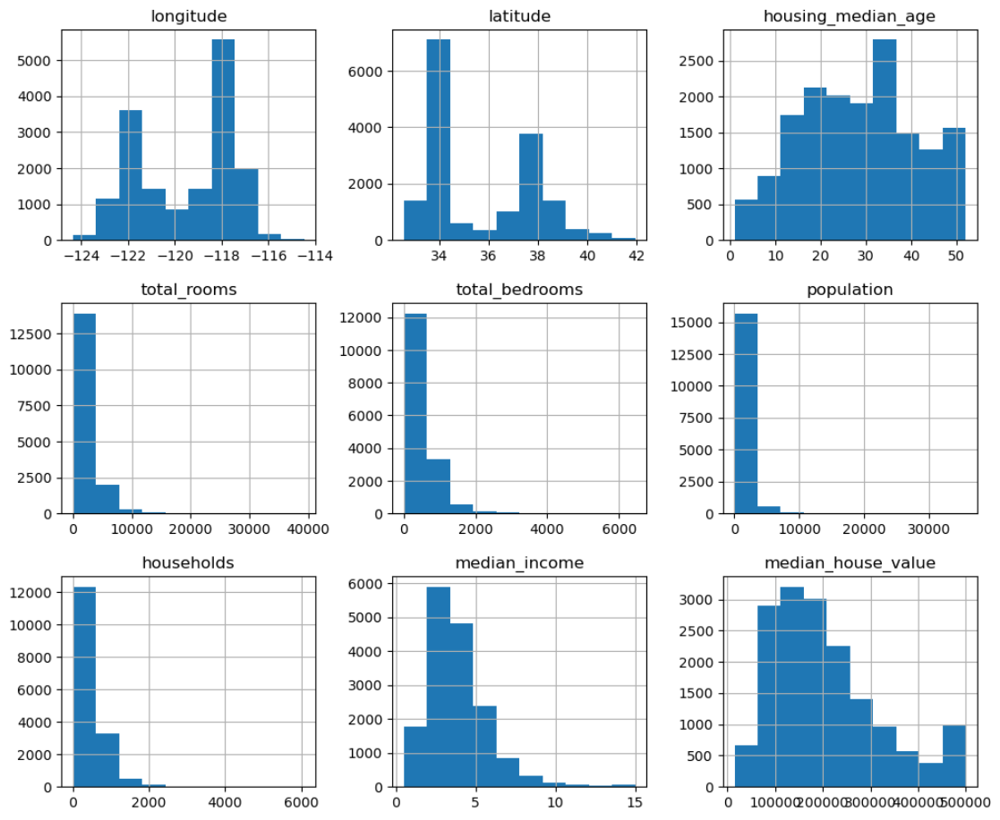

# 🏠 California Housing Price Prediction

A machine learning project that predicts median house prices in California using the California Housing Dataset. This project demonstrates data exploration, model training, and evaluation.

---

## 📊 Project Overview

This project uses features like location, house age, number of rooms, and median income to predict house prices in California districts. The model achieves an R² score of **0.6695**, explaining approximately **67%** of the variance in house prices.

### **Key Highlights:**
- 🎯 End-to-end machine learning pipeline
- 📈 Comprehensive exploratory data analysis (EDA)
- 📊 Multiple visualization techniques
- 🤖 Model evaluation with multiple metrics

---

## 📊 Dataset Information

**Source:** California Housing Dataset (1990 Census)

**Features:**
- `longitude` & `latitude`: Geographic coordinates
- `housing_median_age`: Median age of houses in the district
- `total_rooms`: Total number of rooms in the district
- `total_bedrooms`: Total number of bedrooms in the district
- `population`: District population
- `households`: Number of households in the district
- `median_income`: Median income of households (in tens of thousands)
- `ocean_proximity`: Categorical feature indicating proximity to ocean

**Target Variable:**
- `median_house_value`: Median house value in the district (in USD)

---

## 🔍 Exploratory Data Analysis

### Geographic Distribution of House Prices



**Key Insights:**
- Coastal regions (red/orange dots) have significantly higher house values
- Inland areas show lower median prices (blue dots)
- Clear clustering of expensive housing near major coastal cities

---

### Correlation Analysis







**Key Findings:**
- `median_income` has the **strongest positive correlation (0.69)** with house prices
- Room-related features (`total_rooms`, `total_bedrooms`, `households`) are highly correlated with each other (0.9+)
- Geographic features show negative correlations with house values

---

### Feature Distributions

#### Original Data Distributions


#### After Preprocessing


**Observations:**
- Most features show right-skewed distributions
- `median_house_value` has a noticeable spike at $500,000 (dataset ceiling)
- `median_income` follows a roughly normal distribution
- Population and household features are heavily right-skewed

---

## 🤖 Model Performance

### Model Metrics
```
Root Mean Squared Error (RMSE): $65,602.66
Mean Absolute Error (MAE):      $47,352.25
R² Score:                        0.6695 (66.95%)
```

**Interpretation:**
- The model's predictions are off by approximately **$65,603** on average
- The model explains **67%** of the variance in house prices
- Typical prediction error is around **$47,352**

---

### Actual vs Predicted Prices



**Analysis:**
- Most predictions cluster around the diagonal red line (perfect predictions)
- The model performs well for houses in the $100,000 - $400,000 range
- The vertical clustering at ~$500k shows the dataset's price ceiling

---

## 💻 Code Implementation

### 1. Data Loading
```python
import pandas as pd
import numpy as np
import matplotlib.pyplot as plt
import seaborn as sns

# Load the dataset
data = pd.read_csv('DATA/RAW/housing.csv')
print(data.head())
print(data.info())
```

### 2. Train-Test Split
```python
from sklearn.model_selection import train_test_split

# Separate features and target
X = train_data.drop("median_house_value", axis=1)
y = train_data["median_house_value"]

# Split the data
X_train, X_test_raw, y_train, y_test_raw = train_test_split(
    X, y, test_size=0.2, random_state=42
)
```

### 3. Model Training
```python
from sklearn.linear_model import LinearRegression

# Initialize and train the model
model = LinearRegression()
model.fit(X_train, y_train)

# Make predictions
y_pred = model.predict(X_test_raw)
```

### 4. Model Evaluation
```python
from sklearn.metrics import mean_squared_error, r2_score, mean_absolute_error

# Calculate metrics
mse = mean_squared_error(y_test_raw, y_pred)
rmse = np.sqrt(mse)
mae = mean_absolute_error(y_test_raw, y_pred)
r2 = r2_score(y_test_raw, y_pred)

print(f"Root Mean Squared Error: ${rmse:,.2f}")
print(f"Mean Absolute Error: ${mae:,.2f}")
print(f"R² Score: {r2:.4f}")
```

### 5. Visualization
```python
# Actual vs Predicted Plot
plt.figure(figsize=(10, 6))
plt.scatter(y_test_raw, y_pred, alpha=0.5)
plt.plot([y_test_raw.min(), y_test_raw.max()], 
         [y_test_raw.min(), y_test_raw.max()], 'r--', lw=2)
plt.xlabel('Actual Prices ($)')
plt.ylabel('Predicted Prices ($)')
plt.title('Actual vs Predicted House Prices')
plt.tight_layout()
plt.show()

# Residual Plot
residuals = y_test_raw - y_pred
plt.figure(figsize=(10, 6))
plt.scatter(y_pred, residuals, alpha=0.5)
plt.axhline(y=0, color='r', linestyle='--', lw=2)
plt.xlabel('Predicted Prices ($)')
plt.ylabel('Residuals ($)')
plt.title('Residual Plot')
plt.tight_layout()
plt.show()
```

---

## 🔧 Technologies Used

- **Python 3.x**
- **Pandas** - Data manipulation and analysis
- **NumPy** - Numerical computations
- **Matplotlib** - Data visualization
- **Seaborn** - Statistical visualizations
- **Scikit-learn** - Machine learning algorithms and metrics
- **Jupyter Notebook** - Interactive development environment

---

⭐ **If you found this project helpful, please give it a star!**
